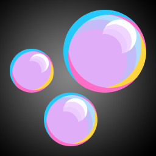
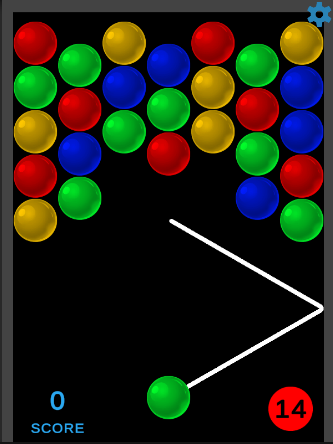
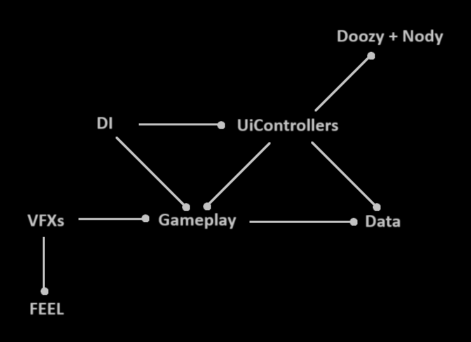

 

    

  <h3>Bubbles Shooter</h3>

  [Download Build](https://github.com/OlegLup/BubblesShooter/blob/main/BUILD_ZIP.zip)

  

  This is simple demo project for portfolio.

  Common architecture:
  1. Gameplay - features logic
  2. Data - non-volatile data
  3. DI - dependency injection code
  4. UiControllers + Doozy + Nody - user interface realization
  5. VFXs + FEEL - effects, sounds and animations realization
  
  
  
  Important points:
  1. LoadingScreen scene is simplest scene with only one purpoise - start application as fast as possible.
  2. RootScene is always active scene with common logic and UI (seetings window).
  3. MainMenu scene is first interactive game scene with UI menu.
  4. CoreGameplay scene is common scene for all game levels.
  5. VContainer is used for DI. Project has several contents: Root, MainMenu, Core.
  6. Interface is separated from logic. "Nody" implements transitions between game windows (double click GameUiFlow file). "Doozy" is used for UI elements and UI windows animations. UiControllers is layer between logic and interface, it uses Nody's Signals for operate transactions.
  7. UniRx is used for reactive properties.
  8. UniTasks and Coroutines are used for asynchronous operations.
  9. All non-volatile data contains in GameData. It automaticaly loads and saves during application start and close (see GameDataController). EasySave3 is used for data serrialization and encrypting.
  10. Project has two game levels. There is UiToolkit->LevelSettingsEditor (editor window for LevelSettings) to help configure game field for each level.
  11. For demonstration purposes project uses Addressables. Root, MainMenu and Core scenes loads as addressables (it may used to reduce build size when assets distribute from cloud). LevelSettings are adreesables configs, only needed config take place in RAM (it may reduce RAM usage on project grow).
  12. For most VFXs FEEL asset is used. There is no VFXs code inside Gameplay features scripts.
  13. Unity Localization package is used to localize texts (en-ru)
  14. Total list of tools used in project: Addressables, Doozy, Feel, DOTween, EasySave3, OdinInspector, UniRx, UniTask, VContainer, Unity Localization
